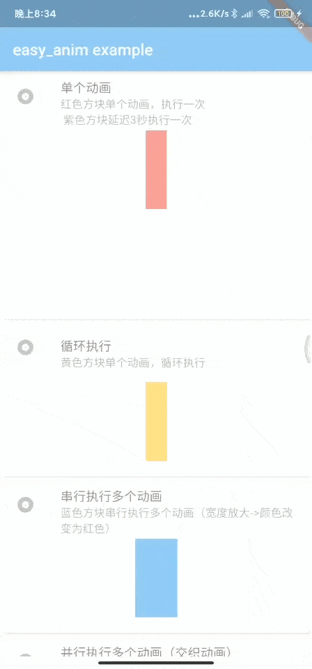
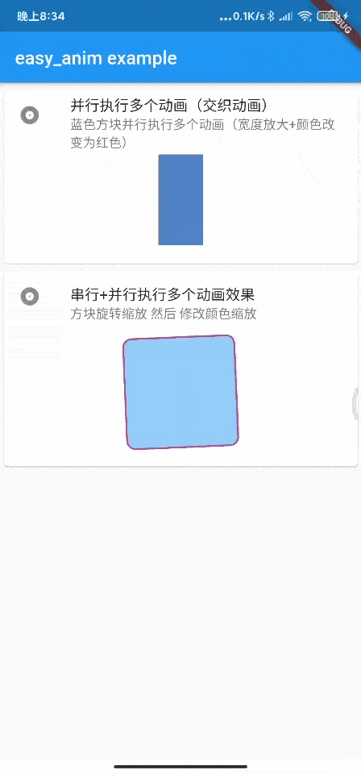

# easy_anim

💨🚀 用一种简单的方式，声明式描述使用Flutter的动画


## 前言

> 谈到Flutter动画的时候，我们一般想到的是什么？
>
> 如果你照着Flutter文档手册看完，脑子里肯定一堆Tween, AnimationController, forward()等等乱七八糟的东西。写肯定是能写，但是非常影响开发效率，并且增加代码的复杂度，如果维护不好很容易就会让代码乱掉
>
> 当然，官方现在也有提供隐式动画如TweenAnimationBuilder可以实现一些简单的单个动画，还有TweenSequence实现串行动画，但是我实际项目中最简单的动画也是缩放同时旋转的并行动画（又称交织动画），所以并不适用，在pub.dev、Github找了几个小时第三方库也没有找到可以声明式的方式简单的方式写动画的库，所以决定自己撸一个
>


## 优点
- 使用组件方式，声明式描述动画
- 自维护controller，使用动画代码简洁
- 支持延时执行动画
- 支持循环执行动画
- 支持并行动画、串行动画以及串行并行动画


## 快速开始

### 添加依赖
``` yaml
dependencies:
  easy_anim: ^3.1.1
```


### 一个极简使用示例

``` dart
import 'package:easy_anim/easy_anim.dart';

EasyTweenAnimation(
  animSequence: [
    EasyTweenAnimationItem(
        animatables: {
          "width": Tween(begin: 0.0, end: 200.0),
        },
        weight: 100,
    ),
  ],
  duration: Duration(seconds: 2),
  builder: (BuildContext context, CurvedAnimation curvedAnimation, Map<String, Animation> animationMap, AnimationController animationController, Widget? child){

    Animation width = animationMap['width'];

    return AnimatedBuilder(animation: curvedAnimation, builder: (context, child){
          return Container(
            width: width.value,
            height: 100,
            decoration: BoxDecoration(
              color: Colors.red
            ),
          );
        },
    );
  }
)
```
示例图的中的第1个动画，将 Container 单个方块宽度从0到200的动画，动画执行时间为2秒<br/>

以上代码类似于CSS动画中的

``` css
@keyframes anim
{
    from { width: 0px; }
    to   { width: 200px; }
}
```


### example工程截图
查看截图效果的对应源码：[example/lib/main.dart](example/lib/main.dart)

 


### 使用示例

``` dart
 import 'package:easy_anim/easy_anim.dart';
 
 EasyTweenAnimation(
   animSequence: [
     EasyTweenAnimationItem(
      animatables: {
        "angle": Tween<double>(begin: 0, end: 1 * pi),
        "color": ColorTween(begin: Colors.blue, end: Colors.blue),
        "width": Tween<double>(begin: 100, end: 100),
      },
      weight: 50.0, // 占总时长的50%，也就是2秒的0%~50%时的动画效果
    ),


    EasyTweenAnimationItem(
      animatables: {
        "color": ColorTween(begin: Colors.blue, end: Colors.red),
        "width": Tween<double>(begin: 100, end: 200),
      },
      weight: 50.0, // 占总时长的50%，也就是2秒的50%~100%时的动画效果
    ),
  ],

  duration: Duration(seconds: 2), // 执行动画总时长
  delay: Duration(milliseconds: 200), // 延时多久执行，默认0秒立即执行
  loop: true, // 是否循环执行动画
  builder: (BuildContext context, CurvedAnimation curvedAnimation, Map<String, Animation> animationMap, AnimationController animationController, Widget? child){

    // 从animationMap里取出各个效果的Animation对象
    Animation angle = animationMap["angle"];
    Animation color = animationMap['color'];
    Animation width = animationMap['width'];

    // AnimatedBuilder 里使用 各个效果的Animation对象value即可
    return AnimatedBuilder(animation: curvedAnimation, builder: (context, child){
      return Transform.rotate(
        angle: angle.value,
        child: Container(
          color: color.value,
          width: width.value,
          height: width.value,
        ),
      );
    });
  },
)

```

##### 一个串行+并行动画，共执行2秒，第1秒方块先旋转角度，第2秒再同时更改颜色和宽度
1. 最外层的 EasyTweenAnimation 为构建动画的组件，里面的 animSequence 参数是各个时间阶段的动画效果，builder 参数是用来返回你想要构建的组件，其他参数则如注释所示
2. EasyTweenAnimationItem 为某个阶段的动画效果，里面的参数 animatables 为各个属性的动画，weight 参数为本阶段占有总时长的时间权重

以上代码类似于CSS动画中的

``` css
@keyframes anim
{
    0% 	  {angle: 0; color: blue; width:100;}
    50%   {angle: 3.14;}
    100%  {color: red; width:200;}
}
```


### 参数说明

#### EasyTweenAnimation 组件参数说明
- [ animSequence: List\<EasyTweenAnimationItem> ] 动画分镜序列
- [ duration: Duration ] 动画执行总时长
- [ curve: Curve ] 动画执行曲线，默认线性
- [ builder: Funtion ] 构建要使用动画的组件
- [ onStatus: Funtion ] 监听动画执行状态回调
- [ child: Widget ] 子组件
- [ delay: Duration ] 延时时间，默认0秒立即执行
- [ loop: bool ] 是否循环执行

#### EasyTweenAnimationItem 组件参数说明

- [ animatables: Map\<String, Animatable> ] 动画效果，该分镜时间段里的动画效果组
	- Map 说明
		- [ key : String tag ] 效果名，如 width
		- [ value : Animatable animatable ] 动画效果，一般使用 Tween 或者 ColorTween
- [ weight: double ] 分镜占动画执行总时长权重百分比(0-100)


### 加入群聊
扫码加我微信加入微信交流群（请备注：Flutter库easy_anim）


#### 🤗 🤗 🤗 如果对您有帮助，请star